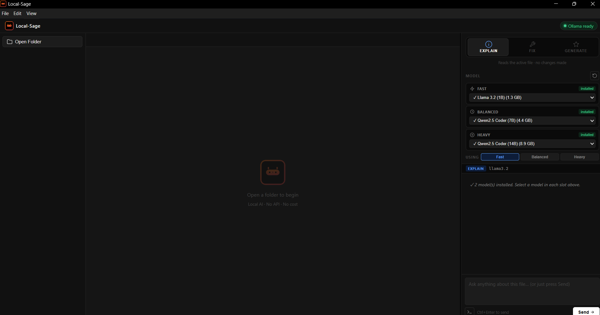
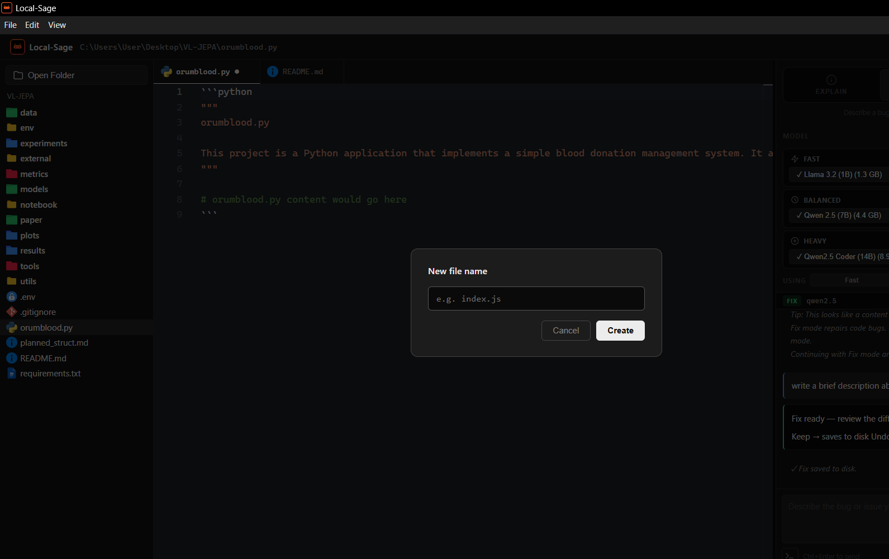
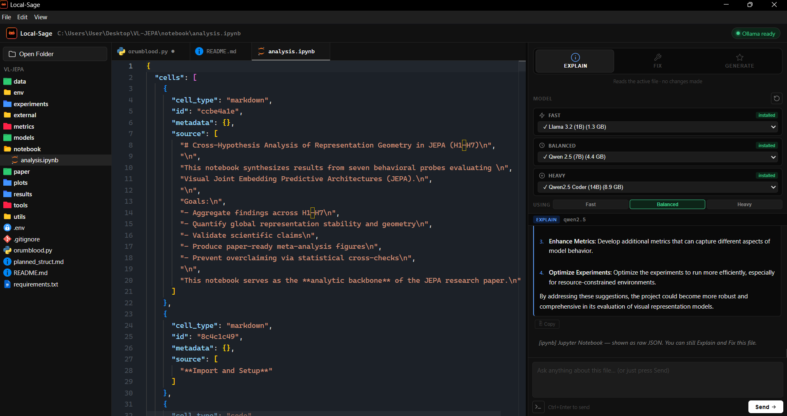
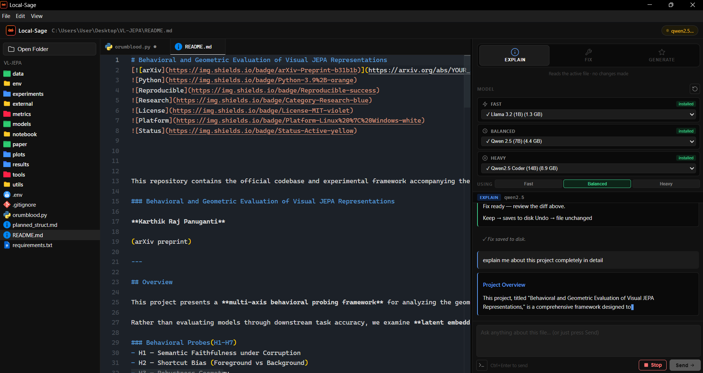
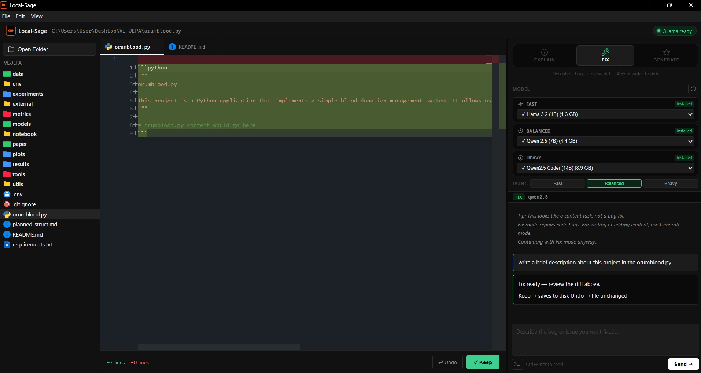
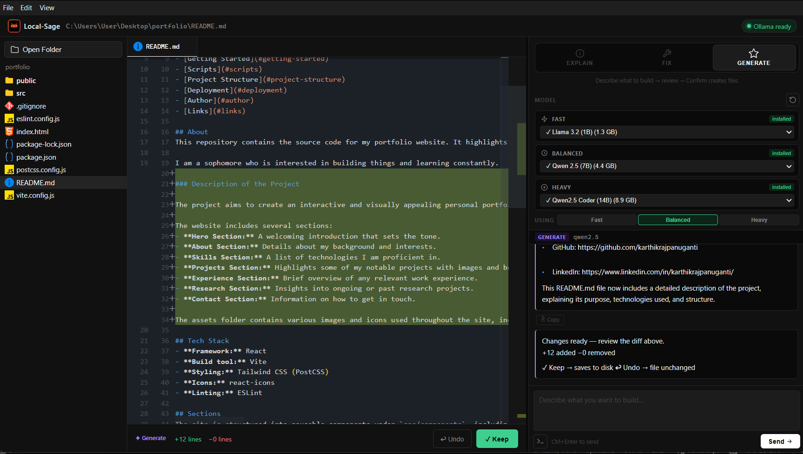

# 🚀 Local-Sage — Local-First AI Coding Environment


> **AI coding without the cloud leash.**

Local-Sage is a **local-first AI-powered coding environment** that brings powerful AI capabilities directly into your development workflow — without relying on cloud APIs, subscriptions, or usage limits.

Built using **Electron** and **Monaco Editor**, Local-Sage delivers an **IDE-like experience** while running entirely on your machine via **Ollama-powered local LLMs**.

---

## 🧠 Why Local-Sage?

Modern AI tools:
- ❌ Depend on paid APIs  
- ❌ Have usage limits  
- ❌ Send your code to the cloud  

Local-Sage solves this by being:

- 🔐 **Private** — runs completely on-device  
- 💸 **Cost-free** — no API usage  
- ⚡ **Local-first** — no internet dependency  
- 🎯 **Controlled** — no blind AI edits  

---

## ✨ Core Features

### 🟢 Explain Mode
- Understand any code instantly  
- Structured breakdown:
  - What it does  
  - How it works  
  - Edge cases  
  - Improvements  

---

### 🟡 Fix Mode (Diff-Based)
- AI suggests fixes using **patch-based editing**
- 🔍 Preview changes in diff view  
- ✅ Apply (Keep)  
- ❌ Reject (Undo)  

> Your code is never modified without your permission.

---

### 🔵 Generate Mode
- Create structured code across multiple files  
- Preview before applying  
- Works directly inside your project  

---

## ⚙️ Tech Stack

- 🖥️ Electron (Desktop App)
- ✏️ Monaco Editor (VS Code engine)
- 🧠 Ollama (Local LLM runtime)
- ⚡ Node.js (Backend + FS control)

---

## 🖼️ Screenshots








---

## ✅ Requirements

- Windows 10/11
- Ollama installed → https://ollama.com

---

## ⬇️ Download

Get the latest installer from Releases:

👉  https://github.com/KARTHIK1749/Local-sage-setup-guide/releases

### 🔗 Direct Download (Recommended)

```text
https://github.com/KARTHIK1749/Local-sage-setup-guide/releases/latest/download/Local-Sage-Setup-1.0.0.exe
```

---

## ⚙️ Setup (Ollama)

1) Install Ollama: https://ollama.com
2) Pull at least one model:

```bash
ollama pull qwen2.5
ollama pull qwen2.5-coder:14b
```

You do not need to run `ollama run ...`.

---

## 🚀 Quick start

1) Install and open Local-Sage
2) Click **Open Folder** and select your project
3) Pick models (Fast/Balanced/Heavy)

Tip: Use **Heavy** models for reliable Fix + Generate.

---

## 📘 Full setup guide

See [SETUP.md](SETUP.md).

---

## ⚠️ Disclaimer

Local-Sage is not a full IDE replacement.

It is a lightweight AI-powered coding layer designed to enhance your workflow while keeping you in control.

---

## 👨‍💻 Built by

**Karthik Panuganti**

- LinkedIn: https://www.linkedin.com/in/karthik-panuganti666
- github: https://github.com/KARTHIK1749
- Portfolio: https://karthikraj.vercel.app/ 